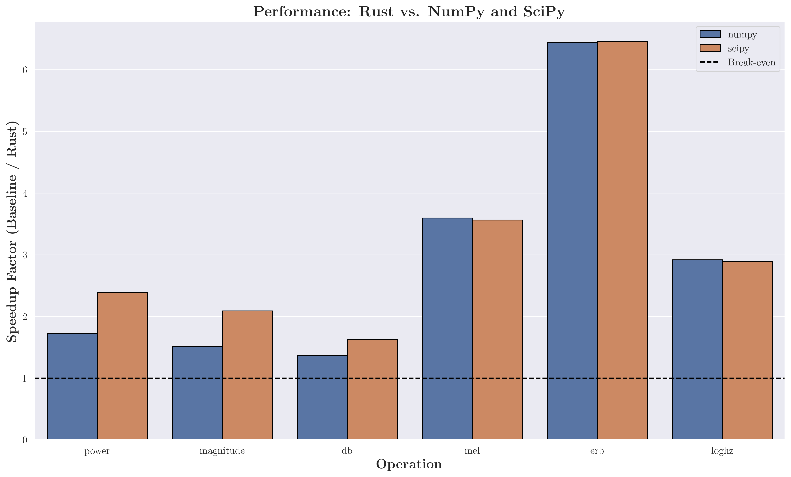

<div align="center">

# Spectrograms

[![Crates.io][crate-img]][crate] [![Docs.rs][docs-img]][docs] [![PyPI][pypi-img]][pypi] [![PyDocs][docs-img-py]][docs-python] [![License: MIT][license-img]][license]

## FFT-based computations for audio and image processing with Rust and Python bindings

</div>

``Spectrograms`` is a library for computing spectrograms and performing FFT-based operations on 1D signals (audio) and 2D signals (images).

Originally, the library was focused on computing spectrograms for audio analysis, but since I had to implement FFT backends anyway, I expanded the scope to include general 1D and 2D FFT operations for both audio and image processing.

If you want to learn more on the background of spectrograms and FFTs in audio/image processing, check out the [manual](./manual/Computational%20Audio%20and%20Image%20Analysis%20with%20the%20Spectrograms%20Library.pdf) (WIP).

## Features

### Core Features

- **Plan-Based Computation**: Reuse and cache FFT plans for speedup on batch processing
- **Two FFT Backends**: pure-Rust RealFFT/RustFFT (default) or FFTW
- **Type-Safe Rust API**: Compile-time guarantees for fft and spectrogram types
- **Python Bindings**: Fast computation with NumPy integration and GIL-free execution. Outperforms NumPy/SciPy implementations across a wide range of configurations, all while providing a type-safe and simple API.

### Audio Processing

- **Multiple Frequency Scales**: Linear, Mel, ERB, and CQT
- **Multiple Amplitude Scales**: Power, Magnitude, and Decibels
- **Advanced Audio Features**: MFCC, Chromagram, and raw STFT
- **Streaming Support**: Frame-by-frame processing for real-time applications

### Image Processing

- **2D FFT Operations**: Fast 2D Fourier transforms for images
- **Spatial Filtering**: Low-pass, high-pass, and band-pass filters
- **Convolution**: FFT-based convolution (faster for large kernels)
- **Edge Detection**: Frequency-domain edge emphasis

### Machine Learning Integration (Python)

- **DLPack Protocol**:  tensor exchange with PyTorch, JAX, and TensorFlow
- **Framework Support**: Convenience modules for PyTorch (`spectrograms.torch`) and JAX (`spectrograms.jax`)
- **Metadata Preservation**: Optional retention of frequency/time axes and parameters
- **Batching Utilities**: Efficient multi-spectrogram batching for training

## Why Choose Spectrograms?

- **Multi-Domain**: Unified API for audio (1D) and image (2D) FFT operations
- **Cross-Language**: Use from Rust or Python with consistent APIs
- **High Performance**: Rust implementation with minimal overhead backed by benchmarks
- **Batch/Stream Processing**: Efficient batch processing and streaming support
- **Well Documented**: [Comprehensive manual](./manual/Computational%20Audio%20and%20Image%20Analysis%20with%20the%20Spectrograms%20Library.pdf) (WIP), lots of examples, and API documentation.

---

## Installation

<table>
<tr>
<th>Rust</th>
<th>Python</th>
</tr>
<tr>
<td>

```bash
cargo add spectrograms
```

</td>
<td>

```bash
pip install spectrograms
```

</td>
</tr>
</table>

---

## Quick Start

### Generate a Test Signal

To remove checks prior to computation the crate uses the `non-empty-slice` crate to guarantee non-empty input.
Alongside this, the crate uses `NonZeroUsize` from the standard library to ensure parameters like FFT size and hop size are valid.

To avoid having to constantly called `NonZeroUsize::new(constant)?` the crates provides the `nzu!` macro to create `NonZeroUsize` values at compile time.

<table>
<tr>
<th>Rust</th>
<th>Python</th>
</tr>
<tr>
<td>

```rust
use non_empty_slice::NonEmptyVec;
use spectrograms::*;
use std::f64::consts::PI;

let sample_rate = 16000.0;
let samples: Vec<f64> = (0..16000)
    .map(|i| {
        let t = i as f64 / sample_rate;
        (2.0 * PI * 440.0 * t).sin()
    })
    .collect();
let samples = NonEmptyVec::new(samples).unwrap();
samples
```

</td>
<td>

```python
import numpy as np
import spectrograms as sg

# 1 second of 440 Hz sine wave
sample_rate = 16000
t = np.linspace(0, 1, sample_rate, dtype=np.float64)
samples = np.sin(2 * np.pi * 440 * t)
```

</td>
</tr>
</table>

### Compute a Basic Spectrogram

<table>
<tr>
<th>Rust</th>
<th>Python</th>
</tr>
<tr>
<td>

```rust
let samples = samples();
// Configure parameters
let stft = StftParams::new(
    nzu!(512),           // FFT size
    nzu!(256),           // hop size
    WindowType::Hanning, // window
    true,                // centre frames
)?;

let params = SpectrogramParams::new(
    stft, 16000.0, // sample rate
)?;

// Compute power spectrogram
let spec = LinearPowerSpectrogram::compute(samples.as_non_empty_slice(), &params, None)?;

println!("Shape: {} bins x {} frames", spec.n_bins(), spec.n_frames());
```

</td>
<td>

```python
# Configure parameters
stft = sg.StftParams(
    n_fft=512,
    hop_size=256,
    window=sg.WindowType.hanning,
    centre=True
)

params = sg.SpectrogramParams(
    stft,
    sample_rate=sample_rate
)

# Compute power spectrogram
spec = sg.compute_linear_power_spectrogram(
    samples,
    params
)

print(f"Shape: {spec.n_bins} bins x {spec.n_frames} frames")
```

</td>
</tr>
</table>

Due to the interpretated nature of Python there is no compile-time guarantee for non-empty input or valid parameters so checks MUST be performed by the python bindings (internally). This incurs negligible overhead and ensures safety.

---

## Mel Spectrogram Example

<table>
<tr>
<th>Rust</th>
<th>Python</th>
</tr>
<tr>
<td>

```rust
let samples = samples();
let stft = StftParams::new(nzu!(512), nzu!(256), WindowType::Hanning, true)?;
let params = SpectrogramParams::new(stft, 16000.0)?;

// Mel filterbank
let mel = MelParams::new(
    nzu!(80), // n_mels
    0.0,      // f_min
    8000.0,   // f_max
)?;

// dB scaling
let db = LogParams::new(-80.0)?;

// Compute mel spectrogram in dB
let spec = MelDbSpectrogram::compute(&samples, &params, &mel, Some(&db))?;

// Access data
println!("Mel bands: {}", spec.n_bins());
println!("Frames: {}", spec.n_frames());
println!("Frequency range: {:?}", spec.axes().frequency_range());
```

</td>
<td>

```python
stft = sg.StftParams(512, 256, sg.WindowType.hanning, True)
params = sg.SpectrogramParams(stft, 16000)

# Mel filterbank
mel = sg.MelParams(
    n_mels=80,
    f_min=0.0,
    f_max=8000.0
)

# dB scaling
db = sg.LogParams(floor_db=-80.0)

# Compute mel spectrogram in dB
spec = sg.compute_mel_db_spectrogram(
    samples, params, mel, db
)

# Access data
print(f"Mel bands: {spec.n_bins}")
print(f"Frames: {spec.n_frames}")
print(f"Frequency range: {spec.frequency_range()}")
```

</td>
</tr>
</table>

---

## Efficient Batch Processing

Reuse FFT plans when processing multiple signals:

<table>
<tr>
<th>Rust</th>
<th>Python</th>
</tr>
<tr>
<td>

```rust
use spectrograms::*;
use non_empty_slice::non_empty_vec;
let signals = vec![
    non_empty_vec![0.0; nzu!(16000)],
    non_empty_vec![0.0; nzu!(16000)],
    non_empty_vec![0.0; nzu!(16000)],
];

let stft = StftParams::new(nzu!(512), nzu!(256), WindowType::Hanning, true)?;
let params = SpectrogramParams::new(stft, 16000.0)?;
let mel = MelParams::new(nzu!(80), 0.0, 8000.0)?;
let db = LogParams::new(-80.0)?;

// Create plan once
let planner = SpectrogramPlanner::new();
let mut plan = planner.mel_plan::<Decibels>(
    &params, &mel, Some(&db)
)?;

// Reuse for all signals (much faster!)
for signal in signals {
    let _spec = plan.compute(&signal)?;
    // Process spec...
}
```

</td>
<td>

```python
signals = [
    np.random.randn(16000),
    np.random.randn(16000),
    np.random.randn(16000),
]

stft = sg.StftParams(512, 256, sg.WindowType.hanning, True)
params = sg.SpectrogramParams(stft, 16000)
mel = sg.MelParams(80, 0.0, 8000.0)
db = sg.LogParams(-80.0)

# Create plan once
planner = sg.SpectrogramPlanner()
plan = planner.mel_db_plan(params, mel, db)

# Reuse for all signals (much faster!)
for signal in signals:
    spec = plan.compute(signal)
    # Process spec...
```

</td>
</tr>
</table>

---

## Machine Learning Integration (Python)

Convert spectrograms to PyTorch or JAX tensors using the DLPack protocol for data sharing:

<table>
<tr>
<th>PyTorch</th>
<th>JAX</th>
</tr>
<tr>
<td>

```python
import spectrograms as sg
import spectrograms.torch  # Adds .to_torch()
import torch

# Compute spectrogram
stft = sg.StftParams(512, 256, sg.WindowType.hanning)
params = sg.SpectrogramParams(stft, 16000)
mel = sg.MelParams(128, 0.0, 8000.0)

spec = sg.compute_mel_power_spectrogram(
    samples, params, mel
)

#  conversion to PyTorch
tensor = spec.to_torch(device='cuda')

# With metadata preservation
result = spec.to_torch(
    device='cuda',
    with_metadata=True
)
print(result.tensor.shape)
print(result.frequencies[:5])
print(result.times[:5])

# Batch multiple spectrograms
specs = [
    sg.compute_mel_power_spectrogram(s, params, mel)
    for s in audio_batch
]
batch = sg.torch.batch(specs, device='cuda')
```

</td>
<td>

```python
import spectrograms as sg
import spectrograms.jax  # Adds .to_jax()
import jax

# Compute spectrogram
stft = sg.StftParams(512, 256, sg.WindowType.hanning)
params = sg.SpectrogramParams(stft, 16000)
mel = sg.MelParams(128, 0.0, 8000.0)

spec = sg.compute_mel_power_spectrogram(
    samples, params, mel
)

#  conversion to JAX
array = spec.to_jax(device='gpu')

# With metadata preservation
result = spec.to_jax(
    device='gpu',
    with_metadata=True
)
print(result.array.shape)
print(result.frequencies[:5])
print(result.times[:5])

# Batch multiple spectrograms
specs = [
    sg.compute_mel_power_spectrogram(s, params, mel)
    for s in audio_batch
]
batch = sg.jax.batch(specs, device='gpu')
```

</td>
</tr>
</table>

**Standard DLPack:** Also works directly with `torch.from_dlpack()`, `jax.dlpack.from_dlpack()`, and TensorFlow.

---

## 2D FFT and Image Processing

Perform 2D FFTs, convolution, and spatial filtering on images:

<table>
<tr>
<th>Rust</th>
<th>Python</th>
</tr>
<tr>
<td>

```rust
use ndarray::Array2;
use spectrograms::fft2d::*;
use spectrograms::image_ops::*;

// Create a 256x256 image
let image = Array2::<f64>::from_shape_fn((256, 256), |(i, j)| {
    ((i as f64 - 128.0).powi(2) + (j as f64 - 128.0).powi(2)).sqrt()
});

// Compute 2D FFT
let spectrum = fft2d(&image.view())?;
println!("Spectrum shape: {:?}", spectrum.shape());
// Output: [256, 129] due to Hermitian symmetry

// Apply Gaussian blur via FFT
let kernel = gaussian_kernel_2d(spectrograms::nzu!(9), 2.0)?;

let _blurred = convolve_fft(&image.view(), &kernel.view())?;

// Apply high-pass filter for edge detection
let _edges = highpass_filter(&image.view(), 0.1)?;

// Compute power spectrum
let _power = power_spectrum_2d(&image.view())?;
```

</td>
<td>

```python

# Create a 256x256 image
image = np.zeros((256, 256), dtype=np.float64)
for i in range(256):
    for j in range(256):
        image[i, j] = np.sqrt((i - 128)**2 + (j - 128)**2)

# Compute 2D FFT
spectrum = sg.fft2d(image)
print(f"Spectrum shape: {spectrum.shape}")
# Output: (256, 129) due to Hermitian symmetry

# Apply Gaussian blur via FFT
kernel = sg.gaussian_kernel_2d(9, 2.0)
blurred = sg.convolve_fft(image, kernel)

# Apply high-pass filter for edge detection
edges = sg.highpass_filter(image, 0.1)

# Compute power spectrum
power = sg.power_spectrum_2d(image)
```

</td>
</tr>
</table>

### Efficient Batch Image Processing

Reuse 2D FFT plans for faster processing:

<table>
<tr>
<th>Rust</th>
<th>Python</th>
</tr>
<tr>
<td>

```rust
use ndarray::Array2;
use spectrograms::fft2d::Fft2dPlanner;

let images = vec![
    Array2::<f64>::zeros((256, 256)),
    Array2::<f64>::zeros((256, 256)),
    Array2::<f64>::zeros((256, 256)),
];

// Create planner once
let mut planner = Fft2dPlanner::new();

// Reuse for all images (faster!)
for image in &images {
    let spectrum = planner.fft2d(&image.view())?;
    let _power = spectrum.mapv(|c| c.norm_sqr());
    // Process power spectrum...
}
```

</td>
<td>

```python
images = [
    np.random.randn(256, 256),
    np.random.randn(256, 256),
    np.random.randn(256, 256),
]

# Create planner once
planner = sg.Fft2dPlanner()

# Reuse for all images (faster!)
for image in images:
    spectrum = planner.fft2d(image)
    power = np.abs(spectrum) ** 2
    # Process power spectrum...
```

</td>
</tr>
</table>

---

## Advanced Features

### MFCCs (Mel-Frequency Cepstral Coefficients)

<table>
<tr>
<th>Rust</th>
<th>Python</th>
</tr>
<tr>
<td>

```rust
let samples = samples();
let stft = StftParams::new(nzu!(512), nzu!(160), WindowType::Hanning, true)?;
let mfcc_params = MfccParams::new(nzu!(13));

let mfccs = mfcc(
    &samples,
    &stft,
    16000.0,
    nzu!(40), // n_mels
    &mfcc_params,
)?;

// Shape: (13, n_frames)
println!("MFCCs: {} x {}", mfccs.nrows(), mfccs.ncols());
```

</td>
<td>

```python
stft = sg.StftParams(512, 160, sg.WindowType.hanning, True)
mfcc_params = sg.MfccParams(n_mfcc=13)

mfccs = sg.compute_mfcc(
    samples,
    stft,
    sample_rate=16000,
    n_mels=40,
    mfcc_params=mfcc_params
)

# Shape: (13, n_frames)
print(f"MFCCs: {mfccs.shape}")
```

</td>
</tr>
</table>

### Chromagram (Pitch Class Profiles)

<table>
<tr>
<th>Rust</th>
<th>Python</th>
</tr>
<tr>
<td>

```rust
let samples = samples();
let stft = StftParams::new(nzu!(4096), nzu!(512), WindowType::Hanning, true)?;
let chroma_params = ChromaParams::music_standard();

let chroma = chromagram(&samples, &stft, 22050.0, &chroma_params)?;

// Shape: (12, n_frames) - one row per pitch class
println!("Chroma: {} x {}", chroma.nrows(), chroma.ncols());

```

</td>
<td>

```python
stft = sg.StftParams(4096, 512, sg.WindowType.hanning, True)
chroma_params = sg.ChromaParams.music_standard()

chroma = sg.compute_chromagram(
    samples,
    stft,
    sample_rate=22050,
    chroma_params=chroma_params
)

# Shape: (12, n_frames)
print(f"Chroma: {chroma.shape}")
```

</td>
</tr>
</table>

---

## Supported Spectrogram Types

### Frequency Scales

- **Linear** (`LinearHz`): Standard FFT bins, evenly spaced in Hz
- **Mel** (`Mel`): Mel-frequency scale, perceptually motivated for speech/audio
- **ERB** (`Erb`): Equivalent Rectangular Bandwidth, models auditory perception
- **CQT**: Constant-Q Transform for music analysis
- **Log** (`LogHz`): Logarithmic frequency spacing

### Amplitude Scales

| Scale | Formula | Use Case |
|-------|---------|----------|
| **Power** | `\|X\|²` | Energy analysis, ML features |
| **Magnitude** | `\|X\|` | Spectral analysis, phase vocoder |
| **Decibels** | `10·log₁₀(power)` | Visualization, perceptual analysis |

### Type Aliases (Rust)

```rust
// Linear frequency
type LinearPowerSpectrogram = Spectrogram<LinearHz, Power>;
type LinearMagnitudeSpectrogram = Spectrogram<LinearHz, Magnitude>;
type LinearDbSpectrogram = Spectrogram<LinearHz, Decibels>;

// Mel frequency
type MelPowerSpectrogram = Spectrogram<Mel, Power>;
type MelMagnitudeSpectrogram = Spectrogram<Mel, Magnitude>;
type MelDbSpectrogram = Spectrogram<Mel, Decibels>;

// ERB frequency
type ErbPowerSpectrogram = Spectrogram<Erb, Power>;
type ErbMagnitudeSpectrogram = Spectrogram<Erb, Magnitude>;
type ErbDbSpectrogram = Spectrogram<Erb, Decibels>;
```

---

## Window Functions

Supported window functions with different frequency/time resolution trade-offs:

- **`rectangular`**: No windowing (best frequency resolution, high leakage)
- **`hanning`**: Good general-purpose window (default)
- **`hamming`**: Similar to Hanning with different coefficients
- **`blackman`**: Low sidelobes, wider main lobe
- **`kaiser=<beta>`**: Tunable trade-off (β controls shape, e.g., `kaiser=5.0`)
- **`gaussian=<std>`**: Smooth roll-off (e.g., `gaussian=0.4`)

<table>
<tr>
<th>Rust</th>
<th>Python</th>
</tr>
<tr>
<td>

```rust
// Parse from string
let window: WindowType = "hanning".parse()?;
let kaiser: WindowType = "kaiser=8.0".parse()?;

// Or use constructors
let hann = WindowType::Hanning;
let gauss = WindowType::Gaussian { std: 0.4 };

// Generate windows
let hann_window = make_window(WindowType::Hanning, nzu!(512));
let kaiser_window = make_window(WindowType::Kaiser { beta: 8.0 }, nzu!(512));
// etc.

// Custom windows
fn my_window_func(n_fft: usize) -> Vec<f64> {
    (0..n_fft).map(|i| (i as f64 / n_fft as f64).sin()).collect()
}
let custom_window = WindowType::Custom(my_window_func);
```

</td>
<td>

```python
# Use class methods for defining types
window = sg.WindowType.hanning
kaiser = sg.WindowType.kaiser(beta=8.0)
gauss = sg.WindowType.gaussian(std=0.4)

# Or create the actual windows
sg.WindowType.hanning_window(n_fft)
sg.WindowType.kaiser_window(n_fft, beta=8.0)
# etc.

# Custom window from SciPy
from scipy.signal.windows import tukey
scipy_window = sg.WindowType.custom(tukey(n_fft, alpha=0.5))
```

</td>
</tr>
</table>

---

## Default Presets

<table>
<tr>
<th>Rust</th>
<th>Python</th>
</tr>
<tr>
<td>

```rust
// Speech processing preset
// n_fft=512, hop_size=160
let params = SpectrogramParams::speech_default(16000.0)?;

// Music processing preset
// n_fft=2048, hop_size=512
let params = SpectrogramParams::music_default(44100.0)?;
```

</td>
<td>

```python
# Speech processing preset
params = sg.SpectrogramParams.speech_default(sample_rate=16000)

# Music processing preset
params = sg.SpectrogramParams.music_default(sample_rate=44100)
```

</td>
</tr>
</table>

---

## Accessing Results

<table>
<tr>
<th>Rust</th>
<th>Python</th>
</tr>
<tr>
<td>

```rust
let spec = LinearPowerSpectrogram::compute(&samples, &params, None)?;

// Dimensions
let n_bins = spec.n_bins();
let n_frames = spec.n_frames();

// Data (ndarray::Array2<f64>)
let data = spec.data();

// Axes
let freqs = spec.axes().frequencies();
let times = spec.axes().times();
let (f_min, f_max) = spec.axes().frequency_range();
let duration = spec.axes().duration();

// Original parameters
let params = spec.params();
```

</td>
<td>

```python
spec = sg.compute_linear_power_spectrogram(samples, params)

# Dimensions
n_bins = spec.n_bins
n_frames = spec.n_frames

# Data (numpy array)
data = spec.data  # shape: (n_bins, n_frames)

# Axes
freqs = spec.frequencies
times = spec.times
f_min, f_max = spec.frequency_range()
duration = spec.duration()

# Original parameters
params = spec.params
```

</td>
</tr>
</table>

---

## Examples

Comprehensive examples in both languages:

**Rust** (`examples/`):

- [`amplitude_scales.rs`](examples/amplitude_scales.rs) - Power, Magnitude, and dB
- [`basic_linear.rs`](examples/basic_linear.rs) - Simple linear spectrogram
- ['compare_windows.rs'](examples/compare_windows.rs) - Window function effects
- ['fft_padding_demo.rs'](examples/fft_padding_demo.rs) - FFT zero-padding effects
- ['fft2d_basic.rs'](examples/fft2d_basic.rs) - 2D FFT basics
- ['image_blur_fft.rs'](examples/image_blur_fft.rs) - FFT-based image blurring
- ['image_edge_detection.rs'](examples/image_edge_detection.rs) - Frequency-domain edge detection
- [`mel_spectrogram.rs`](examples/mel_spectrogram.rs) - Mel spectrogram with dB scaling
- ['readme_snippets.rs'](examples/readme_snippets.rs) - Code snippets from README
- ['reuse_plan.rs'](examples/reuse_plan.rs) - Batch processing with plan reuse
- [`serde_example.rs`](examples/serde_example.rs) - Serialization with Serde
- ['stft_batch.rs'](examples/stft_batch.rs) - Batch STFT computation
- ['stft_multichannel.rs'](examples/stft_multichannel.rs) - Multichannel STFT
- ['stft_streaming.rs'](examples/stft_streaming.rs) - Streaming STFT processing
- ['stmtf.rs'](examples/stmtf.rs) - Spectro-Temporal Modulation Transfer Function (STMTF)

**Python** (`python/examples/`):

- [`basic_linear.py`](python/examples/basic_linear.py) - Linear spectrogram basics
- [`batch_processing.py`](python/examples/batch_processing.py) - Efficient batch processing
- [`chromagram_example.py`](python/examples/chromagram_example.py) - Pitch class profiles
- ['compare_windows.py'](python/examples/compare_windows.py) - Window function effects
- ['custom_window.py'](python/examples/custom_window.py) - Using custom windows
- ['fft2d_basic.py'](python/examples/fft2d_basic.py) - 2D FFT basics
- ['image_blur_fft.py'](python/examples/image_blur_fft.py) - FFT-based image blurring
- ['image_edge_detection.py'](python/examples/image_edge_detection.py) - Frequency-domain edge detection
- [`mel_spectrogram.py`](python/examples/mel_spectrogram.py) - Mel spectrograms
- [`mfcc_example.py`](python/examples/mfcc_example.py) - MFCC computation
- ['readme_snippets.py'](python/examples/readme_snippets.py) - Code snippets from README
- ['stmtf.py'](python/examples/stmtf.py) - Spectro-Temporal Modulation Transfer Function (STMTF)
- [`streaming.py`](python/examples/streaming.py) - Real-time frame-by-frame processing

<table>
<tr>
<th>Rust</th>
<th>Python</th>
</tr>
<tr>
<td>

```bash
cargo run --example basic_linear
cargo run --example mel_spectrogram
```

</td>
<td>

```bash
python python/examples/basic_linear.py
python python/examples/mel_spectrogram.py
```

</td>
</tr>
</table>

---

## Documentation

- **[Manual](./manual/Computational%20Audio%20and%20Image%20Analysis%20with%20the%20Spectrograms%20Library.pdf)**: Comprehensive manual (WIP)
- **[API Documentation](https://docs.rs/spectrograms)**: Full Rust API reference
- **[Python Documentation](https://jmg049.github.io/spectrograms)**: Python API reference and guides
- **[Contributing Guide](CONTRIBUTING.md)**: How to contribute to the project

---

## Feature Flags (Rust)

The Rust library requires exactly one FFT backend:

- **`fftw`**: Uses FFTW for FFT computation
  - Requires system FFTW library (`libfftw3-dev` on Ubuntu/Debian)
  - Not pure Rust

- **`realfft`** (default): Pure-Rust FFT implementation
  - No system dependencies
  - Slightly slower than FFTW
  - Works everywhere

Additional flags:

- **`python`**: Enables Python bindings
- **`serde`**: Enables serialization support

```toml
# Pure Rust, no Python
[dependencies]
spectrograms = { version = "1.0.0", default-features = false, features = ["realfft"] }

# FFTW backend with Python
[dependencies]
spectrograms = { version = "1.0.0", default-features = false, features = ["fftw", "python"] }
```

---

## Benchmarks

Performance benchmarks are available in the `benches/`. Run with:

```bash
cargo bench
```

For Python, a comprehensive benchmark notebook is available at `python/examples/notebook.ipynb` with results comparing ``spectrograms`` to numpy and ``scipy.fft``.

|Operator |Rust (ms)|Rust Std|Numpy (ms)|Numpy Std|Scipy (ms)|Scipy Std|Avg Speedup vs NumPy|Avg Speedup vs SciPy|
|---------|---------|--------|----------|---------|----------|---------|--------------------|--------------------|
|db       |0.257    |0.165   |0.350     |0.251    |0.451     |0.366    |1.363               |1.755               |
|erb      |0.601    |0.437   |3.713     |2.703    |3.714     |2.723    |6.178               |6.181               |
|loghz    |0.178    |0.149   |0.547     |0.998    |0.534     |0.965    |3.068               |2.996               |
|magnitude|0.140    |0.089   |0.198     |0.133    |0.319     |0.277    |1.419               |2.287               |
|mel      |0.180    |0.139   |0.630     |0.851    |0.612     |0.801    |3.506               |3.406               |
|power    |0.126    |0.082   |0.205     |0.141    |0.327     |0.288    |1.630               |2.603               |

For the full benchmark results, see [PYTHON_BENCHMARK](PYTHON_BENCHMARK.md).

[](./imgs/average_speedup.png)

## Performance Tips

1. **Reuse plans**: Use `SpectrogramPlanner` for speedups on batch processing
2. **Choose power-of-2 FFT sizes**: Best performance (512, 1024, 2048, 4096)
3. **Streaming**: Use frame-by-frame processing for real-time applications
4. **FFT**: Try both backends (`realfft` and `fftw`) to see which is faster for your use case

---

## License

This project is licensed under the MIT License - see the [LICENSE](LICENSE) file for details.

---

## Contributing

Contributions are welcome! Please see [CONTRIBUTING.md](CONTRIBUTING.md) for guidelines.

## FAQ / Troubleshooting

- **Q: I get an error about not being able to cast an `ndarray` to an `ndarray`.
  * A: This is a common issue when using the Python bindings. This occurs when the calling function expects a different dtype than what was provided. For example, a ML feature function may expect a `float32` array, whereas, by default, the library computes spectrograms in `float64` for maximum precision. To fix this simply call `.astype(np.float32)` on the spectrogram before passing it to the ML function. I plan to investigate better ways to handle this in the future, such as allowing users to specify the dtype when computing spectrograms.
  This is not always necessary, depending on the function being called, for example, ``numpy`` functions will call the `__array__` method which will automatically cast to the expected dtype.

---

## Citation

If you use this library in academic work, please cite:

```bibtex
@software{spectrograms2026,
  author = {Geraghty, Jack},
  title = {Spectrograms: High-Performance Spectrogram Computation},
  year = {2026},
  url = {https://github.com/jmg049/Spectrograms}
}
```

---

**Note**: This library focuses on computing ffts, spectrograms, and related transforms. For complete audio analysis pipelines, combine it with audio I/O libraries like [audio_samples](https://github.com/jmg049/audio_samples) and your preferred plotting tools.

[crate]: https://crates.io/crates/spectrograms
[crate-img]: https://img.shields.io/crates/v/spectrograms?style=for-the-badge&color=009E73&label=crates.io

[docs]: https://docs.rs/spectrograms
[docs-img]: https://img.shields.io/badge/docs.rs-online-009E73?style=for-the-badge&labelColor=gray

[license-img]: https://img.shields.io/crates/l/spectrograms?style=for-the-badge&label=license&labelColor=gray  
[license]: https://github.com/jmg049/Spectrograms/blob/main/LICENSE

[pypi]: https://pypi.org/project/spectrograms/
[pypi-img]: https://img.shields.io/pypi/v/spectrograms?style=for-the-badge&color=009E73&label=PyPI

[docs-python]: https://jmg049.github.io/Spectrograms/
[docs-img-py]: https://img.shields.io/pypi/v/spectrograms?style=for-the-badge&color=009E73&label=PyDocs
